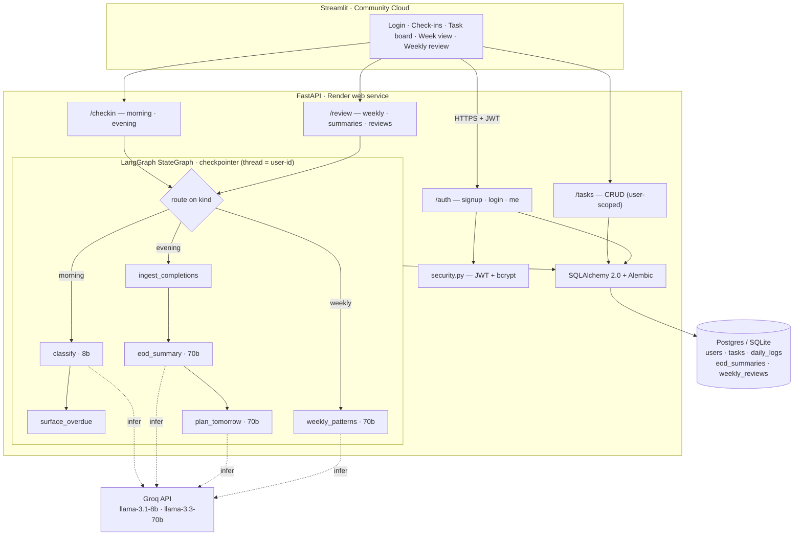

# AltSpace — Architecture

> IITR-SE-2509 · Module 6 Capstone · **Project 03 — Personal Productivity Agent**

AltSpace is an AI **chief of staff**: you check in twice a day, and a LangGraph
agent holds your context across days — classifying tasks, surfacing what
slipped, drafting your end-of-day summary, and planning tomorrow. This document
is the system map for the deck and for anyone reading the repo cold.

---

## 1. The shape in one picture

```
┌──────────────────────────────────────────────────────────────────────────────┐
│  Streamlit (frontend) — Streamlit Community Cloud                              │
│  login · morning/evening check-in · task board · "this week" · weekly review  │
└───────────────────────────────────────────┬──────────────────────────────────┘
                                            │  HTTPS + JWT (Bearer token)
                                            ▼
┌──────────────────────────────────────────────────────────────────────────────┐
│  FastAPI (backend) — Render free web service                                   │
│                                                                                │
│   /auth    signup · login · me            ──▶ security.py  (JWT, bcrypt)        │
│   /tasks   CRUD (scoped to current user)                                        │
│   /checkin morning · evening              ──┐                                   │
│   /review  weekly · summaries · reviews   ──┤                                   │
│                                            │                                   │
│                                            ▼                                   │
│   ┌──────────────────────────────────────────────────────────────────────┐    │
│   │  LangGraph StateGraph  (agent/graph.py)                               │    │
│   │  checkpointer: SqliteSaver (dev) / PostgresSaver (prod)               │    │
│   │  thread_id = "user-{id}"   ← one rolling thread per user = memory     │    │
│   │                                                                       │    │
│   │   ENTRY ──route on kind──▶                                            │    │
│   │     morning:  classify ─▶ surface_overdue                            │    │
│   │     evening:  ingest_completions ─▶ eod_summary ─▶ plan_tomorrow     │    │
│   │     weekly:   weekly_patterns                                        │    │
│   │                                                                       │    │
│   │   LLM via langchain-groq:                                            │    │
│   │     classify/parse  → llama-3.1-8b-instant   (CLASSIFIER_MODEL)      │    │
│   │     summarize/plan  → llama-3.3-70b-versatile (SUMMARY_MODEL)        │    │
│   │   All output speaks in the AltSpace voice (candid chief of staff).   │    │
│   └──────────────────────────────────────────────────────────────────────┘    │
│                                            │                                   │
│                                            ▼                                   │
│                          SQLAlchemy 2.0 ORM  +  Alembic migrations             │
└───────────────────────────────────────────┬──────────────────────────────────┘
                                            ▼
┌──────────────────────────────────────────────────────────────────────────────┐
│  Database — SQLite (dev) / Postgres (prod, Render free)                        │
│  users · tasks · daily_logs · eod_summaries · weekly_reviews                   │
└──────────────────────────────────────────────────────────────────────────────┘
```

---

## 2. Same diagram in Mermaid (for the deck)



---

## 3. Components

| Layer | File(s) | Responsibility |
|---|---|---|
| Frontend | `frontend/streamlit_app.py`, `frontend/lib/*` | All UI. Talks to the backend over HTTP with the JWT in the `Authorization` header. No business logic. |
| API | `backend/app/main.py` + `app/routes/{auth,tasks,checkin,review}.py` | HTTP surface. Validates with Pydantic, enforces auth, scopes every query to `current_user.id`. |
| Auth | `backend/app/security.py` | bcrypt password hashing, JWT mint/verify, `get_current_user` dependency. |
| Agent | `backend/app/agent/{state,nodes,graph}.py` | The LangGraph `StateGraph`. The "brain": classify, surface overdue, summarize, plan, find weekly patterns. |
| LLM | `backend/app/llm.py` | Two Groq model tiers (8b classify, 70b summarize) via `langchain-groq`; robust JSON parsing. |
| Data | `backend/app/{models,database}.py` + `alembic/` | SQLAlchemy 2.0 ORM, session/engine, migrations. |
| Config | `backend/app/config.py` | `pydantic-settings` — one typed `settings` object from env. |

---

## 4. The agent state (memory)

The agent is a single LangGraph `StateGraph` with a **checkpointer** keyed by
`thread_id = f"user-{user_id}"`. Because each user has exactly one rolling
thread, the graph's state persists across days — that is the "memory" the brief
asks for. The state shape (`agent/state.py`) carries the inputs (`user_id`,
`kind`, `raw_text`, `completed_task_ids`) and the working/output fields
(`parsed_tasks`, `overdue`, `eod_summary`, `tomorrow_plan`, `tomorrow_tasks`,
`patterns_text`, `result_message`).

Checkpointer backend follows the DB split: `SqliteSaver` in dev,
`PostgresSaver` in prod — both driven off `DATABASE_URL`.

---

## 5. Data flow — morning check-in

1. User brain-dumps free text into the morning check-in box. Streamlit `POST`s
   `/checkin/morning {raw_text}` with the JWT.
2. The route calls `run_checkin(db, user_id, kind="morning", raw_text=...)`.
3. **`classify` node** — the 8b model parses the free text into structured
   tasks (`title`, `category`, `priority`, `due_date`). Each becomes a `tasks`
   row (`source="morning"`); the raw text is saved to `daily_logs`
   (`kind="morning"`).
4. **`surface_overdue` node** — queries `tasks` where `status="pending"` and
   `due_date < today`, marks them `slipped`, and returns the list.
5. The agent emits an AltSpace-voice greeting + today's plan + the overdue list.
   The route maps the ORM tasks to `TaskOut` and returns
   `CheckinResult{message, planned_tasks[], overdue[]}`.
6. Streamlit renders the greeting, the new task board, and the overdue banner.

```
raw_text ─▶ classify(8b) ─▶ tasks rows + daily_log ─▶ surface_overdue ─▶ greeting + plan + overdue
```

---

## 6. Data flow — evening check-in

1. User marks completed tasks and (optionally) adds a recap. Streamlit `POST`s
   `/checkin/evening {raw_text, completed_task_ids[]}`.
2. The route calls `run_checkin(db, user_id, kind="evening", raw_text=...,
   completed_task_ids=...)`.
3. **`ingest_completions` node** — flips the given tasks to `completed`
   (stamps `completed_at`), parses any newly *emerged* tasks from the recap
   (`source="emerged"`).
4. **`eod_summary` node** — the 70b model drafts a one-paragraph candid summary
   ("here's what you closed, here's what slipped").
5. **`plan_tomorrow` node** — the 70b model proposes tomorrow's tasks from
   slipped items + priorities + patterns, inserting them as `tasks`
   (`source="agent_planned"`).
6. The summary + plan persist to `eod_summaries`. The route returns
   `CheckinResult{eod_summary, tomorrow_plan, tomorrow_tasks[]}`.

```
completions + recap ─▶ ingest_completions ─▶ eod_summary(70b) ─▶ plan_tomorrow(70b)
                                                   └────────────▶ eod_summaries row + tomorrow's tasks
```

---

## 7. Data flow — weekly review

Triggered manually (`POST /review/weekly`) or on a schedule (APScheduler runs
the same function). The **`weekly_patterns` node** runs the 70b model over the
last 7 days of `tasks` + `daily_logs` + `eod_summaries` to surface recurring
patterns ("you've pushed *gym* four weeks running"; category mix). The result
persists to `weekly_reviews` and is read back via `GET /reviews`.

---

## 8. Security & tenancy

- **JWT bearer auth** on every protected route via `get_current_user`.
- **User-scoped queries everywhere** — every DB read/write filters on
  `current_user.id`. A client-supplied user id is never trusted.
- **Passwords** hashed with bcrypt (`passlib`); plaintext is never stored.
- **CORS** restricted to `FRONTEND_ORIGIN` (the Streamlit origin).
- **Secrets** (`GROQ_API_KEY`, `JWT_SECRET`) are environment-only — never
  committed; supplied at deploy time on Render.

---

## 9. Dev vs prod

| | Dev | Prod (Render) |
|---|---|---|
| Database | SQLite file (`altspace.db`) | Render free Postgres |
| Checkpointer | `SqliteSaver` | `PostgresSaver` |
| Migrations | `alembic upgrade head` (local) | run in the Render start command on every deploy |
| Frontend | `streamlit run` on `localhost:8501` | Streamlit Community Cloud |

Both halves are driven off `DATABASE_URL`: unset/`sqlite://` → dev path,
`postgresql://` → prod path. The web filesystem on Render's free tier is
ephemeral, so **Postgres is the durable store in prod** — never a SQLite file.
That durability is what makes the cross-day "memory" story real on the live
demo.
